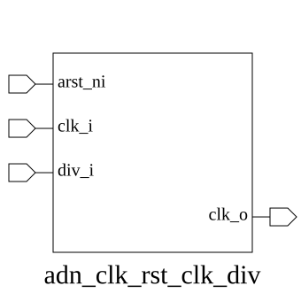

# adn_clk_rst_clk_div (module)

### Author: Foez Ahmed

### Source: adn_clk_rst_clk_div.sv

## Top IO

## Parameters

|Name|Type|Dimension|Default|Description|
|-|-|-|-|-|
|DIV_WIDTH|int||4||

## Ports

|Name|Direction|Type|Dimension|Description|
|-|-|-|-|-|
|arst_ni|input|logic||active low asynchronous reset|
|clk_i|input|logic||input clock|
|div_i|input|logic [DIV_WIDTH-1:0]||input clock divider|
|clk_o|output|logic||output clock|

## Description

Module: adn_clk_rst_clk_div
Author: Foez Ahmed
Brief: One-line summary.
Details: Optional multi-line behavior notes.
