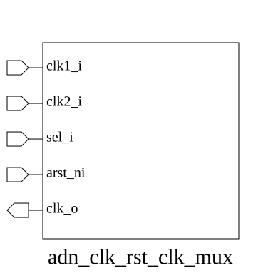
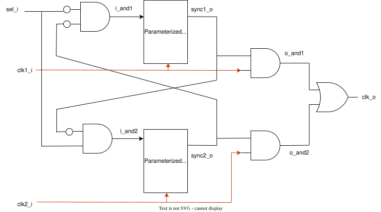

# adn_clk_rst_clk_mux (module)

### Author: Md Sakhawat Hossain Sabbir (sabbirone939@gmail.com)

### Source: adn_clk_rst_clk_mux.sv

## Top IO

## Parameters

|Name|Type|Dimension|Default|Description|
|-|-|-|-|-|
|SYNC_STAGES|int||2|Depth of the synchronizer chain in EACH clock domain, forwarded to adn_common_synchronizer.STAGES. Must be >= 1; >= 2 recommended for metastability hardening.|

## Ports

|Name|Direction|Type|Dimension|Description|
|-|-|-|-|-|
|clk1_i|input|logic||Primary clock input 1|
|clk2_i|input|logic||Secondary clock input 2|
|sel_i|input|logic||Selection signal: 1 selects clk1_i, 0 selects clk2_i|
|arst_ni|input|logic||Active-low asynchronous reset, applied to synchronizers|
|clk_o|output|logic||Glitch-free multiplexed clock output|

## Description

# Purpose
This module implements a glitch-free clock multiplexer designed to switch between two asynchronous clock sources. It utilizes a handshaking mechanism with synchronizers to ensure that the output clock is safely gated before switching, preventing runt pulses or metastability during the transition.

### Use Case
This module is intended for systems requiring dynamic clock switching, such as:
- **Power Management:** Switching between a high-frequency clock for performance and a low-frequency clock for power saving.
- **Clock Failover:** Transitioning to a backup clock source if the primary clock source is detected as unstable or failed.
- **Dynamic Frequency Scaling:** Safely changing clock frequencies without stopping the entire system or causing glitches that could violate timing constraints in downstream logic.

| REVISION | DATE       | AUTHOR                     | DESCRIPTION                                            |
|----------|------------|----------------------------|--------------------------------------------------------|
| 0.1      | 2026-08-12 | Md Sakhawat Hossain Sabbir | Initial version                                        |
| 1.0      | 2026-08-12 | Md Sakhawat Hossain Sabbir | Stable release                                         |

Author : Md Sakhawat Hossain Sabbir (sabbirone939@gmail.com)
