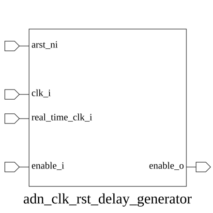

# adn_clk_rst_delay_generator (module)

### Author: Adnan Sami Anirban (adnananirban259@gmail.com)

### Source: adn_clk_rst_delay_generator.sv

## Top IO

## Parameters

|Name|Type|Dimension|Default|Description|
|-|-|-|-|-|
|DELAY_CYCLES|int||10|Number of real_time_clk_i cycles to wait|

## Ports

|Name|Direction|Type|Dimension|Description|
|-|-|-|-|-|
|arst_ni|input|logic||Active-low asynchronous reset|
|clk_i|input|logic||Primary system clock|
|real_time_clk_i|input|logic||Real-time clock for delay counting|
|enable_i|input|logic||Input enable signal|
|enable_o|output|logic||Delayed and synchronized output enable|

## Description

### Purpose
This module generates a programmable delay for an enable signal. It utilizes a real-time clock to count a specified number of cycles before asserting the output enable signal, which is then synchronized to the primary system clock domain.

### Use Case
This module is primarily used in clock and reset management subsystems where a specific delay is required before enabling downstream logic. It is particularly useful for:
- **Power-up Sequencing:** Ensuring that specific blocks are enabled only after a stable clock or power rail has been established.
- **Reset De-assertion:** Providing a controlled delay after a system reset before allowing functional operations to commence.
- **Synchronization:** Bridging signals between a slow real-time clock domain and a high-speed system clock domain with a deterministic latency.

| REVISION | DATE       | AUTHOR          | DESCRIPTION                                            |
|----------|------------|-----------------|--------------------------------------------------------|
| 0.1      | 2026-08-13 | Adnan Sami Anirban | Initial version                                        |
| 1.0      | 2026-08-13 | Adnan Sami Anirban | Stable release                                         |

Author : Adnan Sami Anirban (adnananirban259@gmail.com)
