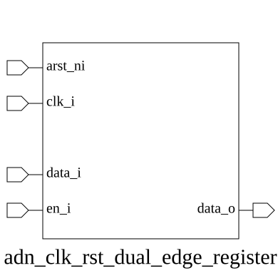

# adn_clk_rst_dual_edge_register (module)

### Source: adn_clk_rst_dual_edge_register.sv

## Top IO

## Parameters

|Name|Type|Dimension|Default|Description|
|-|-|-|-|-|
|WIDTH|int||8|Width of the register|

## Ports

|Name|Direction|Type|Dimension|Description|
|-|-|-|-|-|
|arst_ni|input|logic||active low asynchronous reset|
|clk_i|input|logic||input clock|
|data_i|input|logic [WIDTH-1:0]||data input|
|en_i|input|logic||enable signal for capturing data|
|data_o|output|logic [WIDTH-1:0]||data output|

## Description

_No top-level description found._
